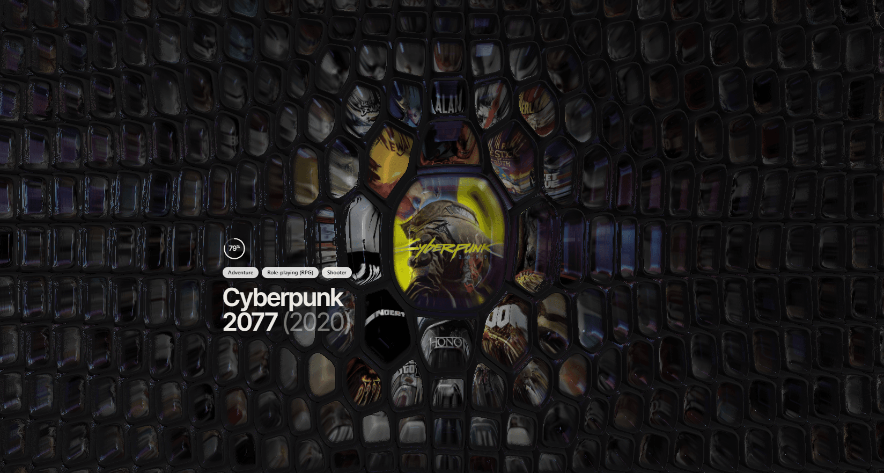

#  Nothing to Play * 25 mil jogos num mosaico de Voronoi em WebGL

Acervo de mais de 25 mil jogos da IGDB renderizados juntos num único mosaico contínuo, com relevo, foco e física de célula rodando na GPU em tempo real.


[Acesse o site em produção →](https://nothing-to-play-web.vercel.app)

> ⚠️ **Ainda não está pronto.** O site está no ar, mas em produção alguns jogos ainda abrem com o card preto, e tem outros detalhes que quero acertar. Vou subindo as correções conforme resolvo.

## Screenshot



## Sobre

Eu tenho centenas de jogos instalados e mesmo assim sempre acho que não tem nada pra jogar. A ideia aqui foi jogar o acervo inteiro na tela de uma vez, sem grid, sem paginação, sem scroll infinito: um campo contínuo onde as 25 mil capas dividem o espaço entre si e a que está no centro cresce, ganha volume e empurra as vizinhas, enquanto o resto afunda no escuro.

Não existe um elemento de HTML por jogo. A cena inteira é um triângulo em tela cheia, e cada pixel decide sozinho de qual célula ele faz parte. O relevo vem de raymarching sobre esse mesmo campo, e as células não são uma grade parada: são partículas com velocidade, presas à origem por mola e ligadas às vizinhas, recalculadas a cada quadro.

## Funcionalidades

- Mosaico contínuo com as 25 mil capas ao mesmo tempo, navegável com o ponteiro
- Diagrama de potência (Voronoi ponderado) resolvido por pixel no fragment shader
- Relevo por raymarching: cada capa fica no fundo de uma moldura com volume, luz e reflexo
- Simulação de forças por quadro, com a célula em foco abrindo um túnel nas vizinhas
- Três presets de aparência (Minimal, Depth, Chaos) e contagem ajustável (5 mil, 10 mil, 25 mil)
- Clique numa capa e abre a ficha com nota, gêneros, plataformas, data e link
- Capa em alta resolução buscada sob demanda pro jogo em foco
- Respiração de 6 segundos e vagar próprio por célula, pro mural nunca ficar imóvel
- Medidor de tempo de quadro e modo tela cheia

## Stack

- **Front:** Next.js 15 + React 19 + TypeScript + Tailwind CSS 4
- **Render:** WebGL2 puro, com shaders GLSL escritos à mão (sem three.js nem lib de cena)
- **Dados:** formato binário próprio de 14 bytes por jogo, lido inteiro na abertura
- **ETL:** Node + sharp, roda offline e cospe os arquivos estáticos
- **Monorepo:** pnpm workspaces
- **Testes:** Vitest, nas funções puras do motor
- **CI:** GitHub Actions (typecheck + testes + build)
- **Deploy:** Vercel, 100% estático, sem backend

## API usada

| API | Função |
| --- | --- |
| [IGDB](https://api-docs.igdb.com/) | Catálogo de jogos: nome, capa, nota, gêneros, plataformas, data e sinopse. Autentica via app da Twitch. |

## Arquitetura

```
apps/web/
├─ app/
│  └─ page.tsx              # intro + mosaico
│
├─ src/
│  ├─ intro/                # tela de abertura, prateleira de nomes
│  ├─ background/           # campo animado do fundo da intro
│  │
│  └─ mosaic/
│     ├─ MosaicStage.tsx    # laço de render, ponteiro, câmera, carga do atlas
│     ├─ GameCard.tsx       # ficha do jogo aberto
│     ├─ FocusCard.tsx      # etiqueta da capa em foco
│     ├─ presets.ts         # Minimal, Depth, Chaos
│     ├─ useGameInfo.ts     # busca o lote de sinopse sob demanda
│     │
│     └─ engine/
│        ├─ renderer.ts     # programas, texturas, passes
│        ├─ simulation.ts   # física das células, o coração do mosaico
│        ├─ manifest.ts     # leitor do formato binário
│        ├─ grid.ts         # mundo, tela, zoom
│        └─ shaders/
│           ├─ voronoi.ts   # campo de distância e recorte da capa
│           └─ post.ts      # raymarching do relevo, luz, profundidade
│
└─ public/
   ├─ atlas/                # 9 atlas WebP + manifesto binário
   └─ info/                 # sinopses em lotes de 500

tools/etl/                  # roda na máquina, não em produção
├─ fetch-games.ts           # puxa o catálogo da IGDB
├─ build-atlas.ts           # baixa as capas e monta os atlas
└─ build-info.ts            # quebra as sinopses em lotes
```

## Rodando localmente

```bash
git clone https://github.com/Pedroaruana/Nothing-to-Play.git
cd Nothing-to-Play
pnpm install
pnpm dev
```

Os atlas e as sinopses já vêm no repositório, então o site roda direto, sem chave nenhuma.

Só se você quiser regerar os dados do zero é que precisa de credencial da Twitch (que é o que autentica na IGDB). Copie o `.env.example` pra `.env`, preencha, e rode dentro de `tools/etl`:

```bash
pnpm fetch    # baixa o catálogo da IGDB
pnpm atlas    # monta os atlas de capa
pnpm info     # gera os lotes de sinopse
```

## Testes

```bash
pnpm test
```

Cobrem a parte do motor que é função pura e que quebra calada quando erra:

- **espiral do lattice** — a conta que decide qual jogo aparece em qual posição precisa ser bijeção. Se dois pontos caírem no mesmo índice, dois lugares da tela mostram o mesmo jogo; se sobrar buraco, algum jogo nunca aparece
- **câmera** — o ponto sob o cursor tem que ficar parado enquanto a roda do mouse gira, e o zoom tem que respeitar os limites
- **leitor do manifesto binário** — cada campo lido da posição certa dentro dos 14 bytes, contagem de páginas, e recusa de arquivo com formato errado

Shader não entra: aquilo se verifica olhando a tela.

## Desafios

**A tela ficava preta nos primeiros segundos e eu jurava que era bug no shader.** Passei um tempo caçando isso no relevo, no campo de distância, na câmera. O motivo era bem mais bobo: enquanto o atlas não chegou, a célula só tem a cor média da capa, e eu já aplicava por cima o escurecimento das células longe do foco. Duas coisas escuras somadas dão preto. Resolvi fazendo o escurecimento entrar em rampa, só depois que a primeira página de atlas carrega.

**Escrevi um compressor de textura inteiro e não usei nada dele.** Achei que precisava mandar as capas comprimidas direto pra GPU, então implementei DXT1 do zero, escrita de DDS, e até um descompressor separado só pra medir o erro e confirmar que os bytes estavam certos. Funcionava. Só que quando terminei o motor, atlas em WebP resolvia igual e com um décimo do trabalho. Otimizei antes de saber se precisava, e joguei fora umas boas horas.

**A moldura estava dez vezes mais grossa e eu não entendia por quê.** Fui atrás da constante que controlava a espessura, achei o valor de referência, coloquei igual, e continuou errado. Só depois percebi que aquele número passava por um segundo fator que eu não estava aplicando. Uma multiplicação faltando, e eu passei muito mais tempo do que devia olhando pro shader.

**A capa fica afundada no meio da célula, e isso é de propósito.** Já "consertei" isso duas vezes achando que era defeito. Nas duas o relevo inteiro ficou chapado e eu tive que voltar atrás. Deixei um comentário no código pra parar de tentar.

---

Pedro Aruanã

## Licença

MIT — veja [LICENSE](LICENSE).
